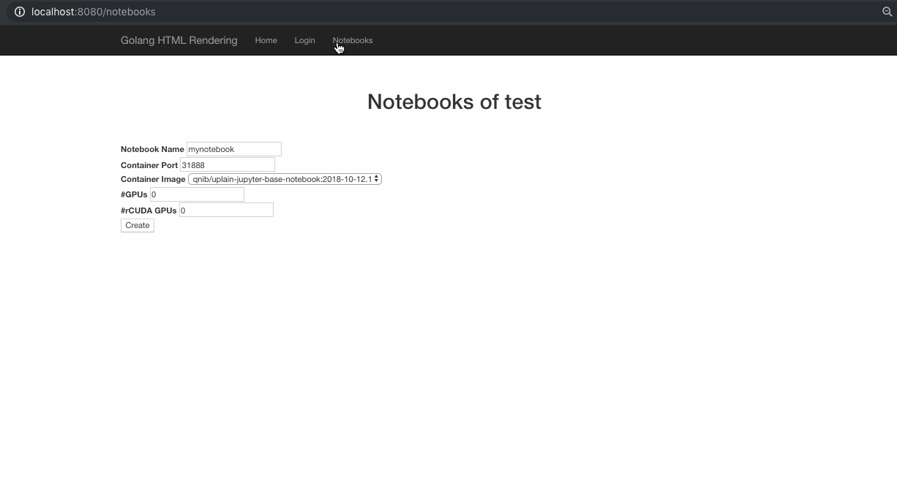

# Kubernetes Deployment

In order to make the kubernetes-spawner work, a service account needs to be created.

### Create an account and extract secrets

```
$ kubectl create serviceaccount jupyter
serviceaccount "jupyter" created
$ export K8S_SECRET=$(kubectl get serviceaccounts jupyter -o json |jq -r '.secrets[].name')
$ kubectl get secret ${K8S_SECRET} -ojson | jq -r '.data["token"]' | base64 -D > k8s/token
2o4lkq324w7u3dg6o3a95nelz
$ kubectl get secret ${K8S_SECRET} -ojson | jq -r '.data["ca.crt"]' | base64 -D > k8s/ca.crt
u32rzcljur84t6j9mglpxkvri
```

### Docker-App

Using the docker-app (can be found [here](https://github.com/docker/app/releases), something to check out anyway!) we can create the pod, accessing the information needed.

```
$ docker-app deploy --orchestrator=kubernetes -s backend=kubernetes
```

### Start Notebook

**Fixed Route**: For now there is a fixed route to a notebook, so please
 - use the user `test` to login
 - keep the notebook name `mynotebook`




