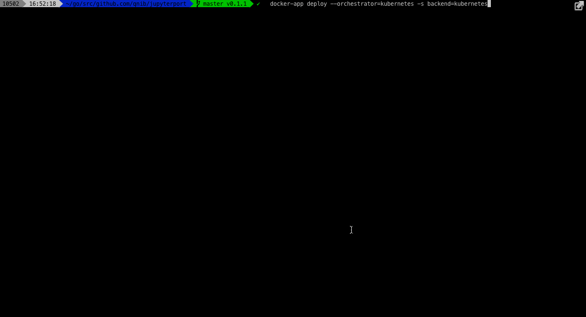

# jupyterport
GOLANG version of JupyterHub.

**Do not use this in production, it is for prototyping purposes**

## Scope
This project aims to provide:

- [ ] Login (no password used for now)
- [X] session handling, so that a user can authenticate
- handle notebook startup
   - [X] DockerDesktop
   - [ ] DockerEE
- [ ] provide admin overview

## Example Stack
JupyterPort has a pluggable backend system to spawn the notebooks.

- **docker** uses `/var/run/docker.sock` to fire up plain containers (no docker service or kubernetes pod)
- **kubernetes** uses a kubernetes service account to create a deployment and a service for each notebook

### Try it yourself

The [Kubernetes.md](Kubernetes.md) file has a how-to going to the steps to set up the kubernetes stack.

### General
Some pieces are missing, including

- [ ] Create a random token and show it in the notebook list
- [ ] use a reverse proxy, so that the notebook does not need to expose a port, but is access through the JupyterPort webserver
    - [X] Static route so that user-mynotebook is proxied
    - [ ] make this dynamic when a notebook is created
- [ ] the port selection should be randomized, so that one does not know in advance which ports are unused

### Docker

## Kubernetes

In addition to the general TODOs, the kubernetes spawner has more..

- [ ] Direct URL is not showing correctly
